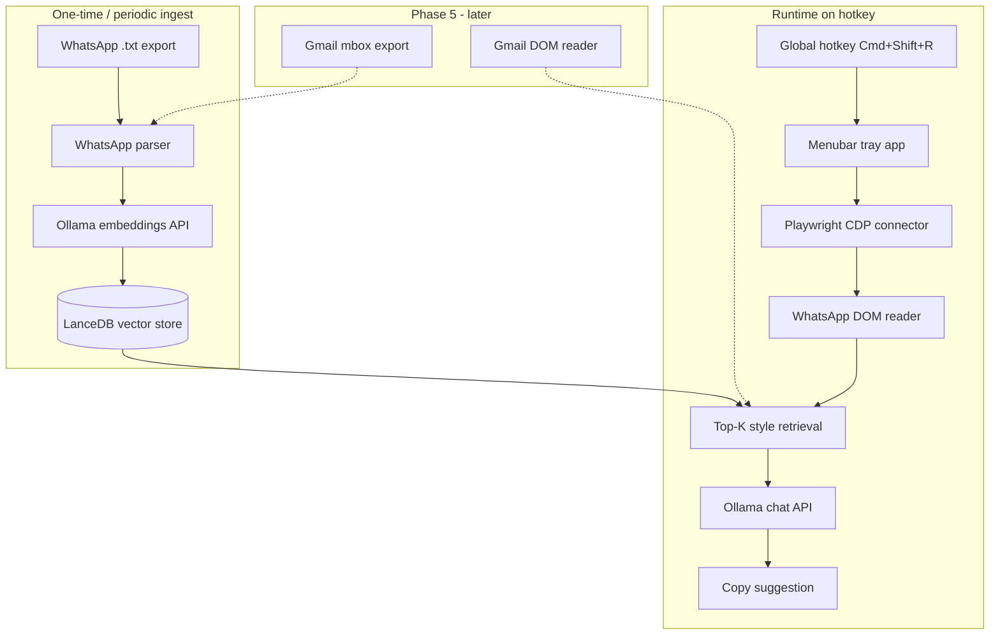

# Plan — Personal Reply Agent

Greenfield macOS menubar app that learns your writing style from WhatsApp exports (Gmail later) via a custom local RAG pipeline with LanceDB, reads active WhatsApp Web threads through Playwright + CDP, and suggests replies powered by Ollama.

No reuse of existing agent frameworks (CrewAI, LangChain, embedchain, mem0, etc.) on this machine.

---

## Goal

1. Ingest **WhatsApp (.txt export)** history first to learn how you write — **Gmail added in Phase 5**
2. Run **fully local RAG** (LanceDB vector search + Ollama generation)
3. Read the **active WhatsApp Web tab** in your browser (Gmail later)
4. Surface **style-matched reply suggestions** via a **menubar app + global hotkey**, copy-to-clipboard (optional insert later)

---

## Architecture



---

## Project layout

```
personal-reply-agent/
├── pyproject.toml              # Python 3.11+, minimal deps
├── README.md
├── PLAN.md
├── TODO.md
├── config.toml                 # Ollama models, hotkey, Chrome debug port
├── data/                       # gitignored: exports, LanceDB tables
├── scripts/
│   ├── launch_chrome_debug.sh  # Start Chrome with CDP port 9222
│   └── ingest.sh               # Wrapper for ingest CLI
└── src/personal_reply/
    ├── __main__.py             # Entry: menubar app
    ├── menubar.py              # rumps tray UI + hotkey trigger
    ├── config.py               # Load config.toml
    ├── ingest/
    │   ├── whatsapp_txt.py     # Phase 1: Parse WhatsApp export format
    │   ├── gmail_mbox.py       # Phase 5: Parse mbox (stub until then)
    │   └── pipeline.py         # Chunk, embed, upsert
    ├── rag/
    │   ├── store.py            # LanceDB table create/upsert
    │   ├── embed.py            # httpx → Ollama /api/embeddings
    │   └── retrieve.py         # LanceDB vector search top-K
    ├── llm/
    │   └── ollama_client.py    # httpx → Ollama /api/chat
    ├── browser/
    │   ├── connector.py        # Attach Playwright to existing Chrome via CDP
    │   ├── whatsapp.py         # Phase 2: Extract thread + compose box selectors
    │   └── gmail.py            # Phase 5: Gmail adapter (stub until then)
    └── reply/
        ├── prompt.py           # System prompt + few-shot from retrieval
        └── generate.py         # Orchestrate: context → RAG → LLM → reply
```

---

## Core design decisions

### 1. Custom RAG with LanceDB

Use **LanceDB** as the local vector store — purpose-built for embedding search, stored on disk as Apache Lance files:

- **Table**: `messages` at `data/style.lance/`
- **Schema**:
  - `id` (string, UUID)
  - `platform` (string: `gmail` | `whatsapp`)
  - `contact` (string)
  - `text` (string — your sent message)
  - `context_before` (string — 1–2 incoming messages before your reply)
  - `timestamp` (timestamp)
  - `vector` (fixed-size float list — matches `nomic-embed-text` dimension)
- **Embeddings**: `POST http://localhost:11434/api/embeddings` with `nomic-embed-text`
- **Retrieval**: LanceDB native search — `table.search(query_vector).limit(8).to_pandas()`
- **Upsert**: batch insert on ingest; optional `merge_insert` for re-ingest dedup by `id`
- **Chunking**: one row per message you sent (not whole threads)

### 2. Style ingestion from exports

**Phase 1 (WhatsApp only):**

| Source | Parser logic | What gets indexed |
|--------|--------------|-------------------|
| WhatsApp .txt | Regex for `[date, time] You:` lines | Lines attributed to you |

**Phase 5 (Gmail — deferred):**

| Source | Parser logic | What gets indexed |
|--------|--------------|-------------------|
| Gmail mbox | Python `mailbox` stdlib | Messages where `From` matches your address(es) |

Store 1–2 incoming messages before each of your replies as `context_before` metadata (used in prompt, not embedded separately).

### 3. Browser reading (Playwright + CDP)

1. Launch Chrome with `--remote-debugging-port=9222` (`scripts/launch_chrome_debug.sh`)
2. Playwright connects to existing session (keeps WhatsApp Web login intact)
3. **WhatsApp adapter** (Phase 2) detects `web.whatsapp.com` and parses DOM

**WhatsApp Web:**
- Read visible messages from main pane (sender + text)
- Compose: `[contenteditable="true"][data-tab="10"]` (with fallbacks)
- Non-WhatsApp tabs → clear menubar error

**Gmail (Phase 5):**
- Thread messages from `.a3s.aiL` / role=main region
- Reply: `[aria-label="Message Body"]` contenteditable

Normalized thread struct (Gmail plugs in later):

```python
@dataclass
class ThreadContext:
    platform: Literal["whatsapp", "gmail"]
    contact_or_subject: str
    messages: list[{role: "them"|"me", text: str}]
    compose_selector: str | None
```

### 4. Reply generation

`reply/prompt.py` builds:

- **System**: match tone, length, punctuation, formality of retrieved examples
- **Few-shot**: top retrieved past replies (with `context_before`)
- **User**: current thread transcript + "Suggest a reply to the latest message."

Ollama `/api/chat` with `llama3.2` (configurable in `config.toml`).

Output: 1 primary suggestion + optional shorter alternative.

### 5. Menubar UX

`menubar.py` using **rumps**:

- Menu: **Suggest Reply**, **Re-ingest exports**, **Settings**, **Quit**
- Global hotkey **Cmd+Shift+R** via `pynput`
- On success: notification + auto-copy to clipboard
- Phase 4 (optional): insert into compose box via Playwright

---

## Dependencies

| Package | Purpose |
|---------|---------|
| `lancedb` | Local vector store + ANN search |
| `pyarrow` | LanceDB table schema / Arrow interop |
| `playwright` | CDP browser attach + DOM read |
| `httpx` | Ollama HTTP API |
| `rumps` | macOS menubar |
| `pynput` | Global hotkey |
| `tomli` / `tomllib` | Config |

**Ollama models:**
- `nomic-embed-text` — embeddings
- `llama3.2` — reply generation

---

## Setup flow (first run — WhatsApp)

1. Create venv, install deps, `playwright install chromium`
2. Export a WhatsApp chat (.txt) → `data/exports/`
3. `python -m personal_reply.ingest.pipeline` → builds `data/style.lance/`
4. Start Chrome via debug script, open **WhatsApp Web**
5. `python -m personal_reply`
6. **Cmd+Shift+R** on an open thread → suggestion copied to clipboard

---

## Phased delivery

### Phase 1 — WhatsApp RAG foundation (no browser)
- WhatsApp `.txt` ingest parser only
- LanceDB vector store + Ollama embed/retrieve
- Retrieval filtered to `platform = whatsapp`
- CLI: `python -m personal_reply.cli suggest --text "..."`

### Phase 2 — WhatsApp browser reader
- CDP connector + WhatsApp-only DOM adapter
- Reject non-WhatsApp tabs with helpful error
- CLI: `python -m personal_reply.cli suggest --from-browser`

### Phase 3 — Menubar app
- rumps tray + hotkey + clipboard
- Settings for model names and export path
- End-to-end: WhatsApp Web → suggest → copy

### Phase 4 — WhatsApp polish (optional)
- Insert reply into compose box
- Periodic background re-ingest
- Per-contact style weighting

### Phase 5 — Gmail support
- Gmail mbox ingest parser
- Gmail browser DOM adapter
- Platform-aware retrieval
- Menubar accepts WhatsApp Web and Gmail tabs

---

## Risks and mitigations

| Risk | Mitigation |
|------|------------|
| WhatsApp/Gmail DOM changes | Isolate selectors in adapter files; WhatsApp first |
| Chrome not in debug mode | Clear error + link to launch script |
| Ollama not running | Health check on startup |
| Weak style match with small corpus | Explicit style rules in prompt; ingest stats in menu |
| Privacy | All data stays in `data/` locally |

---

## Out of scope

- Extending gmailTestCrew or any existing repo
- embedchain, mem0, CrewAI, LangChain, Cursor browser MCP
- Browser extension (desktop + Playwright instead)
- Cloud LLM APIs (Ollama only)
